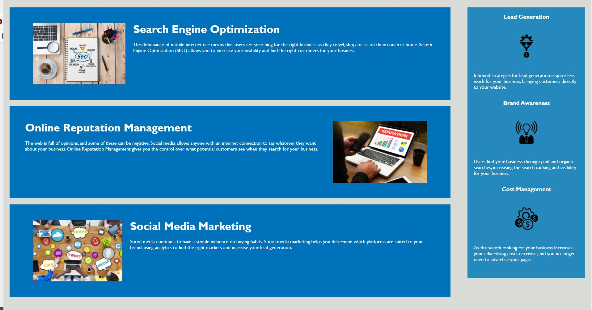

# Horiseon Website

## Purpose
Horiseon is a search engine optimization   (SEO), online reputation management, and social media marketing firm

To optimize their own website for search engines and accessibility, best practices have been followed to produce a search engine and screen reader-friendly web page

## Features
* Designated header, with included navigation links
* Discreate sections and articles to highlight content
* Aside designations
* Alt text for all images
* A lean and flexible style sheet ready to style more content as the webpage changes

## Preview Images

